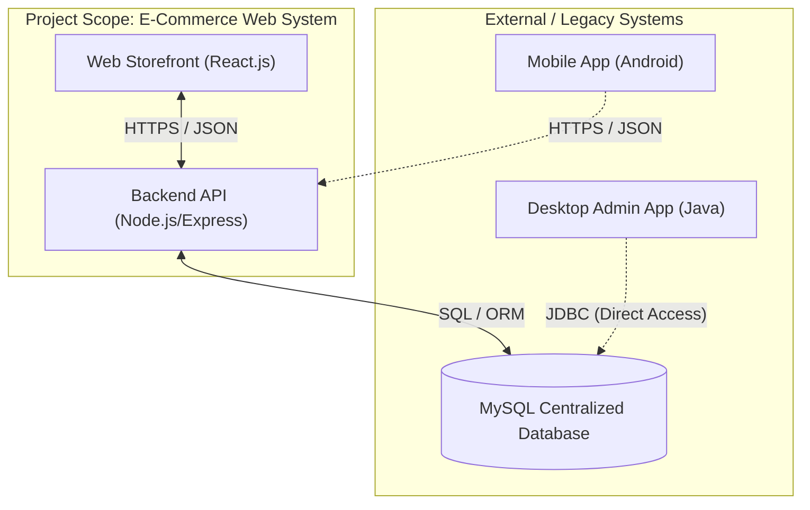
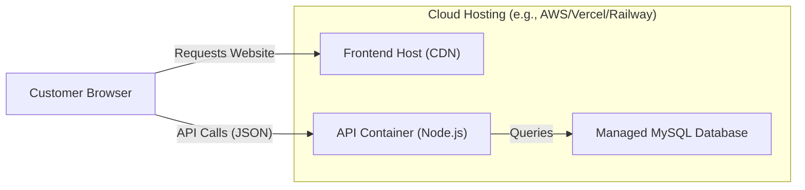
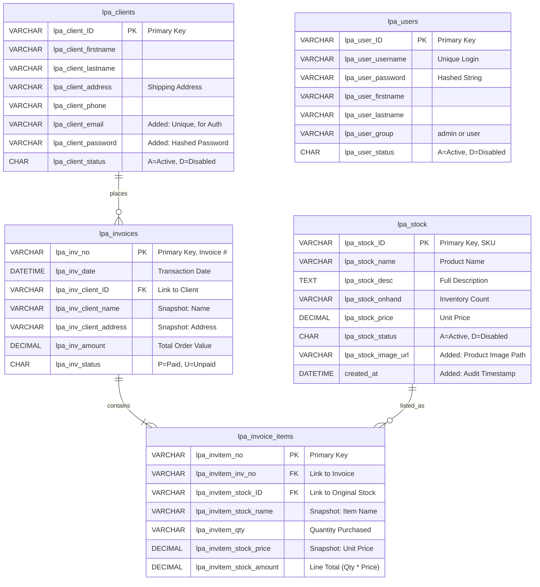

# Índice

0. [Ficha del proyecto](#0-ficha-del-proyecto)
1. [Descripción general del producto](#1-descripción-general-del-producto)
2. [Arquitectura del sistema](#2-arquitectura-del-sistema)
3. [Modelo de datos](#3-modelo-de-datos)
4. [Especificación de la API](#4-especificación-de-la-api)
5. [Historias de usuario](#5-historias-de-usuario)
6. [Tickets de trabajo](#6-tickets-de-trabajo)
7. [Pull requests](#7-pull-requests)

---

## 0. Ficha del proyecto

### **0.1. Tu nombre completo:**

Miguel Angel Rodríguez Ullilén

### **0.2. Nombre del proyecto:**

LPA eComms - E-commerce for for the retail of physical electronics

### **0.3. Descripción breve del proyecto:**

**LPA eComms** is a comprehensive e-commerce software solution designed for the retail of physical electronics. The project aims to modernize the retail experience by integrating a customer-facing web and mobile storefront with a centralized, robust administrative backend.

The system is architected to handle the specific complexities of electronic hardware retail, utilizing a custom-built architecture to ensure scalability, security, and seamless data synchronization between the consumer mobile/web interface and the internal desktop management system.

### **0.4. URL del proyecto:**

[https://github.com/mrodriguezul/cti-adp-software](https://github.com/mrodriguezul/cti-adp-software)

## 1. Descripción general del producto

**LPA eComms** is a comprehensive e-commerce software solution designed for the retail of physical electronics. The project aims to modernize the retail experience by integrating a customer-facing web and mobile storefront with a centralized, robust administrative backend.
The system is architected to handle the specific complexities of electronic hardware retail, utilizing a custom-built architecture to ensure scalability, security, and seamless data synchronization between the consumer mobile/web interface and the internal desktop management system.

### **1.1. Objetivo:**

* **Centralized Data Management:** Implement a unified MySQL database structure to synchronize data across the Mobile/Web storefronts and the Desktop Administrative interface, ensuring real-time consistency in stock levels and pricing.
* **Secure Transaction Processing:** Develop a secure checkout flow that captures customer details, shipping information, and simulates payment processing while generating accurate invoice records.
* **Role-Based Access Control (RBAC):** Enforce strict security protocols where Administrators have full read/write access (for stock and user management) while standard Users are restricted to read-only access or self-service account updates.
* **Modern Customer Experience:** Deliver a responsive, user-friendly shopping experience including product discovery, persistent shopping carts, and intuitive navigation.

### **1.2. Características y funcionalidades principales:**

* **Product Focus:** Specialized for **Physical Electronics**, supporting rich metadata and inventory-dependent availability within the `lpa_stock` system.
* **Architecture:**
  * **Frontend (Storefront):** Modern mobile-first web interface (Android/WebView compatible) for customer interaction.
  * **Backend (Admin):** Java-based Desktop interface for internal staff to manage stock, invoices, and users.
  * **Database:** Centralized MySQL database acting as the single source of truth, featuring tables for Stocks, Clients, Invoices, and Users.
* **Security:** Implementation of hashed password storage (e.g., Blowfish) and session management to protect user data.
* **Scalability:** Designed with a modular structure (Product Catalog, Cart, User Auth) to allow for future feature expansion such as real-time shipping calculation or API integrations.

The following functionalities are prioritized to ensure the Core Value Proposition is met while allowing for future enhancements.

| Priority | Functionality | Description & Modern Implementation |
| :--- | :--- | :--- |
| **High (P1)** | **Product Catalog (PIM)** | Centralized storage of products with rich metadata (Name, SKU, Price, Description, Stock Level). Supports retrieval for both the web storefront and admin inventory management. |
| **High (P1)** | **Cart & Session Management** | Functionality for users to add/remove items and adjust quantities. Uses modern session storage or cookies to persist cart data during the shopping session. |
| **High (P1)** | **Checkout & Invoicing** | A multi-step flow collecting shipping and payment info. Upon completion, it automatically generates an invoice record in the database and updates inventory counts. |
| **High (P1)** | **Order Management (OMS)** | Backend capability for Admins to view, search, and manage generated invoices. Includes calculating total sales amounts and tracking order status. |
| **High (P1)** | **Authentication & Authorization** | Secure Login/Register system. Differentiates between "Customers" (Web) and "Staff/Admins" (Desktop), ensuring users only access permitted data. |
| **High (P1)** | **Stock Management** | A dedicated interface for Admins to Create, Read, Update, and Delete (CRUD) stock items. Includes toggling item status (Enabled/Disabled). |
| **Medium (P2)** | **Search & Filtering** | Robust search bar and filtering options (by Price, Name, Category) to help customers find specific electronics quickly. |
| **Medium (P2)** | **Customer Profile** | Self-service portal where registered customers can view their details and update shipping addresses or contact info. |
| **Medium (P2)** | **Payment Gateway Simulation** | A mockup of the payment process (e.g., via Stripe Sandbox or generic selection) to validate credit card inputs and handle "Success/Fail" transaction states. |
| **Low (P3)** | **Reviews & Ratings** | System allowing verified purchasers to leave star ratings and text reviews on products to build social proof. |
| **Low (P3)** | **Wishlist** | Feature allowing users to save items for future consideration without reserving stock or adding them to the immediate transaction. |
| **Low (P3)** | **Related Products** | Recommendation engine displaying "You might also like" items based on the current product view to increase Average Order Value. |

### **1.3. Diseño y experiencia de usuario:**

> Proporciona imágenes y/o videotutorial mostrando la experiencia del usuario desde que aterriza en la aplicación, pasando por todas las funcionalidades principales.

### **1.4. Instrucciones de instalación:**

> Documenta de manera precisa las instrucciones para instalar y poner en marcha el proyecto en local (librerías, backend, frontend, servidor, base de datos, migraciones y semillas de datos, etc.)

---

## 2. Arquitectura del Sistema

### **2.1. Diagrama de arquitectura:**

The project utilizes a **Headless Architecture**, separating the frontend presentation layer from the backend business logic. This allows the E-Commerce Web Application to be agile and modern while sharing a centralized database with the legacy Desktop system.

* **Scope:** This specific project implements the **Web Storefront** and **Backend API**.
* **External Context:** The system is designed to coexist with a Java Desktop Application (Admin) and Android Application (Mobile) as defined in the broader business requirements



### **2.2. Descripción de componentes principales:**

### A. Web Storefront (Frontend)

The customer-facing Single Page Application (SPA) designed to provide a modern, responsive user experience.
  
* **Technology:** React.js, Tailwind CSS, Axios.
* **Responsibility:**
  * **Presentation:** Renders the Product Catalog, Product Details, and Shopping Cart interfaces.
  * **State Management:** Manages "Client-Side State" (e.g., keeping the cart active across different pages without reloading).
  * **API Consumption:** Acts as a client that consumes the Backend API to fetch products and submit orders.

### B. Backend API (Service Layer)

The bridge between the user interface and the data, handling all business logic and security.

* **Technology:** Node.js, Express framework, Prisma (ORM).
* **Responsibility:**
  * **Endpoints:** Exposes RESTful endpoints (e.g., `GET /products`, `POST /checkout`, `POST /login`).
  * **Security:** Handles Password Hashing (using Blowfish/Bcrypt)  and verifies user sessions via Tokens.
  * **Validation:** Validates business rules, such as ensuring stock quantity is sufficient before processing an order.

### C. Centralized Database (Persistence)

The shared storage engine that acts as the single source of truth for both the Web Storefront and the external Desktop/Mobile applications.

* **Technology:** MySQL.
* **Responsibility:**
  * Stores the `lpa_stock`, `lpa_clients`, `lpa_invoices`, and `lpa_users` tables as required by the schema definitions.
  * Maintains data consistency across all platforms.

### **2.3. Descripción de alto nivel del proyecto y estructura de ficheros**

The project follows a clean separation between the API and the Client.

```
/lpa-ecomms-web
│
├── /backend-api            # Node.js Server
│   ├── /src
│   │   ├── /config         # Database connection (Host, User, Pass)
│   │   ├── /controllers    # Logic: ProductController.js, CartController.js
│   │   ├── /models         # Schema: Stock.js, Client.js, Invoice.js
│   │   ├── /routes         # API Routes: authRoutes.js, productRoutes.js
│   │   └── server.js       # App Entry Point
│   ├── .env                # Environment variables (DB Credentials)
│   └── package.json
│
├── /frontend-client        # React Application
│   ├── /public             # Static assets (favicon, manifest)
│   ├── /src
│   │   ├── /assets         # Images (Logo, Banners)
│   │   ├── /components     # UI: Navbar.jsx, ProductCard.jsx, CartDrawer.jsx
│   │   ├── /pages          # Views: Home.jsx, Shop.jsx, Checkout.jsx
│   │   ├── /context        # State: AuthContext.jsx, CartContext.jsx
│   │   └── /api            # Axios setup & endpoints
│   └── package.json
│
└── /docs                   # Documentation & ERD Diagrams
```

### **2.4. Infraestructura y despliegue**

**Deployment Process** The deployment focuses on hosting the Web components.

* **Database Provisioning:**
  * A Managed MySQL instance is provisioned on a cloud provider.
  * SQL schema scripts are executed to initialize the required tables (lpa_stock, lpa_invoices, etc.).

* **Backend Deployment:**
  * The Node.js API is containerized using Docker.
  * The container is deployed to a PaaS (Platform as a Service) like Railway or AWS ECS.
  * Environment variables are configured to securely connect to the Database.

* **Frontend Deployment:**
  * The React application is built (transpiled to static HTML/JS/CSS) using npm run build.
  * The artifacts are deployed to a global Content Delivery Network (CDN) such as Vercel or Netlify for high availability and speed.



### **2.5. Seguridad**

### A. Secure Password Storage

* **Requirement:** Passwords must never be stored in plain text to protect user credentials in case of a data breach.
* **Implementation:** The system utilizes the **Blowfish/Bcrypt** hashing algorithm with salt. When a user registers, their password is immediately hashed before being written to the `lpa_users` table. During login, the input password is hashed and compared against the stored hash.

### B. API Authentication & Authorization

* **Requirement:** Restrict access to personal data and administrative functions.
* **Implementation:** The system implements **JSON Web Tokens (JWT)**.
  * **Login:** Upon successful authentication, the server issues a signed JWT.
  * **Protected Routes:** The client must attach this token to the header (`Authorization: Bearer <token>`) of every subsequent request (e.g., viewing order history). The backend verifies the token signature before processing the request.

### C. Input Validation & Sanitization

* **Requirement:** Prevent malicious data from corrupting the database or executing unauthorized commands.
* **Implementation:** The API implements strict validation layers (e.g., using libraries like Joi or Zod).
  * **Sanitization:** All incoming data is stripped of dangerous characters to prevent **SQL Injection** and **Cross-Site Scripting (XSS)**.
  * **Type Checking:** The system enforces strict data types (e.g., ensuring "Stock Quantity" is an integer) before interaction with the database.

### D. CORS Policies (Cross-Origin Resource Sharing)

* **Requirement:** Prevent unauthorized external websites from interacting with the backend API.
* **Implementation:** The backend is configured to accept requests **only** from the specific domain where the Web Storefront is hosted. All other origins are blocked by the browser's security policy.

### **2.6. Tests**

### A. Unit Testing

* **Frontend (Jest / Vitest):**
  * **Component Logic:** Tests to ensure individual UI components behave correctly (e.g., verifying that the "Add to Cart" button actually increments the cart count).
  * **Form Validation:** Tests to confirm that forms reject invalid inputs (e.g., invalid email formats or empty required fields) before sending data to the server.
* **Backend (Jest):**
  * **Business Logic:** Tests to verify calculation functions, such as ensuring the "Total Order Amount" accurately sums the prices of all items in the cart.

### B. Integration Testing

* **API Workflow:**
  * **Checkout Process:** Automated tests that simulate a complete user purchase flow via the API.
        1.  Send a `POST` request to `/api/checkout` with mock product data.
        2.  **Verify:** The server returns a 200 OK status.
        3.  **Verify:** A new invoice row is created in the `lpa_invoices` table.
        4.  **Verify:** The `lpa_stock_onhand` value for the purchased item decreases by the correct quantity in the database.

---

## 3. Modelo de Datos

### **3.1. Diagrama del modelo de datos:**

**Entity Relationship Diagram (ERD)**
The following diagram represents the normalized schema for the LPA eComms system. It illustrates the relationships between the Inventory (Stock), Customers (Clients), Sales (Invoices), and System Administrators (Users).

**Key Architectural Decisions:**

* **Historical Data Preservation:** The `lpa_invoices` and `lpa_invoice_items` tables are intentionally "denormalized" to store snapshots of data (like address and price) at the time of purchase. This prevents old invoices from changing if a product price or client address changes in the future.
* **Separation of Concerns:** `lpa_users` is strictly for internal staff (Admins/Stock Managers), while `lpa_clients` manages external customer data.



### **3.2. Descripción de entidades principales:**

### A. Table: `lpa_stock` (Product Catalog)

Represents the inventory of physical electronics available for sale.

* **Purpose:** Central repository for all product information displayed on the Web Storefront and managed via the Desktop Admin App.
* **Columns:**
  * `lpa_stock_ID` (**PK**, VARCHAR 20): Unique identifier (SKU).
  * `lpa_stock_name` (VARCHAR 250): The display name of the product.
  * `lpa_stock_desc` (TEXT): Detailed HTML or text description of the product specs.
  * `lpa_stock_onhand` (VARCHAR 5): Current quantity in the warehouse. *Optimization Note: In a production DB, this should be `INT`, but we adhere to VARCHAR as per requirements.*
  * `lpa_stock_price` (DECIMAL 7,2): Unit cost (e.g., 999.99).
  * `lpa_stock_status` (CHAR 1): 'A' (Active) or 'D' (Disabled) to soft-delete items without removing data.
  * `lpa_stock_image_url` (**Added**): Path to the product image for the frontend gallery.
* **Constraints:** `lpa_stock_ID` is Unique. `lpa_stock_price` must be >= 0.

### B. Table: `lpa_clients` (Customers)

Represents the external users who register on the website to purchase items.

* **Purpose:** Stores customer shipping details and authentication credentials.
* **Columns:**
  * `lpa_client_ID` (**PK**, VARCHAR 20): Unique Client ID.
  * `lpa_client_firstname` / `lastname` (VARCHAR 50): Customer's legal name.
  * `lpa_client_address` (VARCHAR 250): Default shipping address.
  * `lpa_client_phone` (VARCHAR 30): Contact number for delivery.
  * `lpa_client_status` (CHAR 1): Account status.
  * `lpa_client_email` (**Added**): Essential for modern login and order notifications.
  * `lpa_client_password` (**Added**): Required for the "Customer Login" requirement. Stores the Bcrypt hash.
* **Constraints:** `lpa_client_email` must be Unique.

### C. Table: `lpa_invoices` (Orders)

Represents the header information of a completed sales transaction.

* **Purpose:** Tracks the financial transaction, date, and "Who bought what".
* **Columns:**
  * `lpa_inv_no` (**PK**, VARCHAR 20): Unique Invoice Number.
  * `lpa_inv_date` (DATETIME): Exact timestamp of purchase.
  * `lpa_inv_client_ID` (**FK**, VARCHAR 20): References `lpa_clients.lpa_client_ID`.
  * `lpa_inv_client_name` / `address`: **Snapshot fields**. These store the name/address *as they were at the moment of purchase*, ensuring historical accuracy even if the client profile changes later.
  * `lpa_inv_amount` (DECIMAL 8,2): Total sum of all items in the order.
  * `lpa_inv_status` (CHAR 1): e.g., 'P' (Paid), 'S' (Shipped).
* **Relationships:** Many-to-One with `lpa_clients`.

### D. Table: `lpa_invoice_items` (Order Line Items)

Represents the specific products included within a single invoice.

* **Purpose:** Acts as a bridge table between Invoices and Stock, allowing multiple items per order.
* **Columns:**
  * `lpa_invitem_no` (**PK**, VARCHAR 20): Unique Line Item ID.
  * `lpa_invitem_inv_no` (**FK**, VARCHAR 20): References `lpa_invoices.lpa_inv_no`.
  * `lpa_invitem_stock_ID` (**FK**, VARCHAR 20): References `lpa_stock.lpa_stock_ID`.
  * `lpa_invitem_stock_name` (VARCHAR 250): Snapshot of the product name.
  * `lpa_invitem_qty` (VARCHAR 6): Quantity purchased.
  * `lpa_invitem_stock_price` (DECIMAL 7,2): Snapshot of price at the time of sale.
  * `lpa_invitem_stock_amount` (DECIMAL 7,2): Calculated field (`qty * price`).
* **Relationships:** Many-to-One with `lpa_invoices`; Many-to-One with `lpa_stock`.

### E. Table: `lpa_users` (Internal Staff)

Represents the internal staff members who access the Desktop Application.

* **Purpose:** Controls access to the Admin Dashboard (RBAC).
* **Columns:**
  * `lpa_user_ID` (**PK**, VARCHAR 20): Unique User ID.
  * `lpa_user_username` (VARCHAR 30): Login username.
  * `lpa_user_password` (VARCHAR 50/255): Hashed password.
  * `lpa_user_group` (VARCHAR 50): Defines permissions ('admin' has RW access, 'user' has Read-Only).
  * `lpa_user_status` (CHAR 1): Account status.
* **Constraints:** `lpa_user_username` must be Unique.

---

## 4. Especificación de la API

> Si tu backend se comunica a través de API, describe los endpoints principales (máximo 3) en formato OpenAPI. Opcionalmente puedes añadir un ejemplo de petición y de respuesta para mayor claridad

---

## 5. Historias de Usuario

> Documenta 3 de las historias de usuario principales utilizadas durante el desarrollo, teniendo en cuenta las buenas prácticas de producto al respecto.

**Historia de Usuario 1**

**Historia de Usuario 2**

**Historia de Usuario 3**

---

## 6. Tickets de Trabajo

> Documenta 3 de los tickets de trabajo principales del desarrollo, uno de backend, uno de frontend, y uno de bases de datos. Da todo el detalle requerido para desarrollar la tarea de inicio a fin teniendo en cuenta las buenas prácticas al respecto. 

**Ticket 1**

**Ticket 2**

**Ticket 3**

---

## 7. Pull Requests

> Documenta 3 de las Pull Requests realizadas durante la ejecución del proyecto

**Pull Request 1**

**Pull Request 2**

**Pull Request 3**

