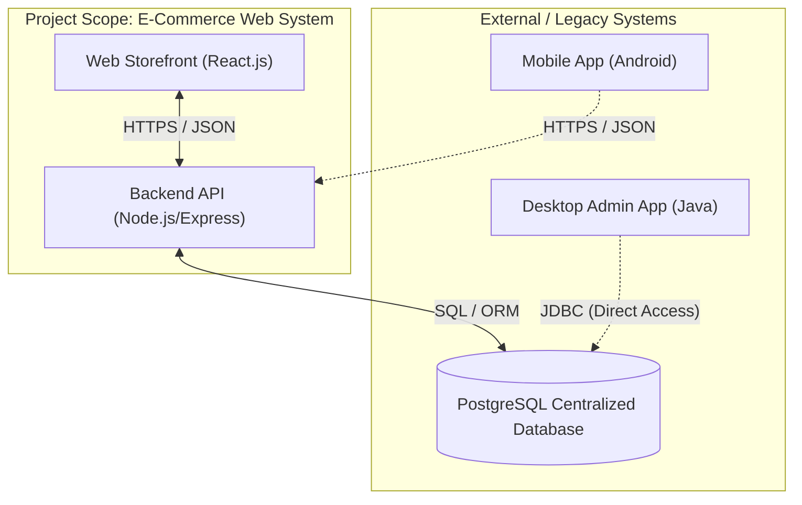
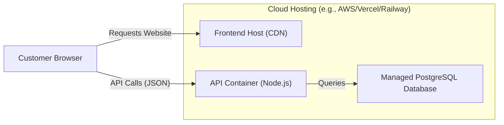
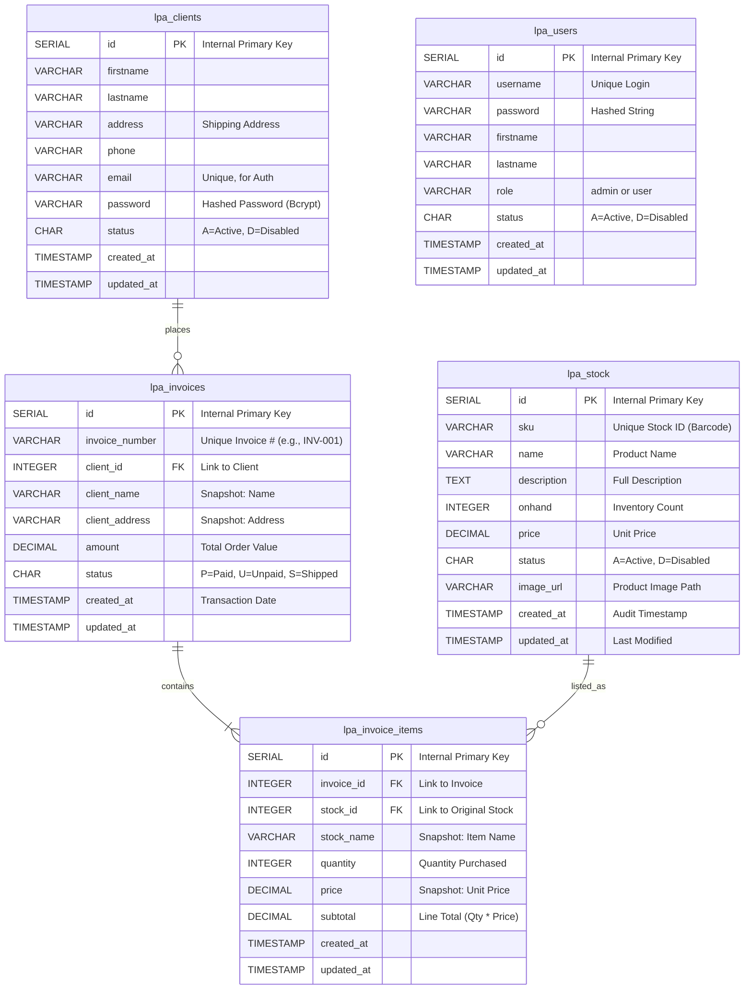

# Índice

0. [Ficha del proyecto](#0-ficha-del-proyecto)
1. [Descripción general del producto](#1-descripción-general-del-producto)
2. [Arquitectura del sistema](#2-arquitectura-del-sistema)
3. [Modelo de datos](#3-modelo-de-datos)
4. [Especificación de la API](#4-especificación-de-la-api)
5. [Historias de usuario](#5-historias-de-usuario)
6. [Tickets de trabajo](#6-tickets-de-trabajo)
7. [Pull requests](#7-pull-requests)

---

## 0. Ficha del proyecto

### **0.1. Tu nombre completo:**

Miguel Angel Rodríguez Ullilén

### **0.2. Nombre del proyecto:**

LPA eComms - E-commerce for for the retail of physical electronics

### **0.3. Descripción breve del proyecto:**

**LPA eComms** is a comprehensive e-commerce software solution designed for the retail of physical electronics. The project aims to modernize the retail experience by integrating a customer-facing web and mobile storefront with a centralized, robust administrative backend.

The system is architected to handle the specific complexities of electronic hardware retail, utilizing a custom-built architecture to ensure scalability, security, and seamless data synchronization between the consumer mobile/web interface and the internal desktop management system.

### **0.4. URL del proyecto:**

[https://github.com/mrodriguezul/cti-adp-software](https://github.com/mrodriguezul/cti-adp-software)

## 1. Descripción general del producto

**LPA eComms** is a comprehensive e-commerce software solution designed for the retail of physical electronics. The project is structured with a clear separation of concerns:

- **Web Storefront (This Application):** Customer-facing online shopping experience for browsing products, managing carts, and placing orders
- **Desktop Admin Application:** Java-based application for internal staff to manage inventory, process orders, and handle fulfillment
- **Admin Web Application (Future):** Planned web-based admin panel for additional administrative functions

The system is architected to handle the specific complexities of electronic hardware retail, utilizing a custom-built architecture to ensure scalability, security, and seamless data synchronization across all applications through a centralized PostgreSQL database.

### **1.1. Objetivo:**

* **Centralized Data Management:** Implement a unified PostgreSQL database structure to synchronize data across the Web/Mobile storefronts and the Admin applications, ensuring real-time consistency in stock levels and pricing.
* **Secure Customer Transaction Processing:** Develop a secure checkout flow that captures customer details, shipping information, and simulates payment processing while generating accurate invoice records.
* **Customer-Only Web Experience:** Deliver a responsive, user-friendly shopping experience including product discovery, persistent shopping carts, and intuitive navigation exclusively for customers.
* **Separate Admin Operations:** All administrative functions (inventory management, order fulfillment, user management) are handled in dedicated admin applications with appropriate access controls and workflows.

### **1.2. Características y funcionalidades principales:**

#### **Web Storefront (This Application):**
* **Product Catalog & Discovery:** Full product browsing with search, filtering by price and category, and sorting capabilities
* **Product Details:** Rich product information including specifications, images, availability status, and customer reviews
* **Shopping Experience:** Persistent shopping cart, quantity management, and visual stock indicators
* **User Accounts:** Registration, login, profile management, password security, and order history
* **Checkout & Orders:** Multi-step checkout with address collection, mock payment processing, order review, confirmation, and invoicing
* **Customer Features:** Wishlists, product reviews, personalized recommendations, order notifications, and quick reorder functionality
* **Database:** Centralized PostgreSQL database with `lpa_stock` (products), `lpa_clients` (customers), `lpa_invoices` (orders)

#### **Admin Services (Separate Applications):**
* **Desktop Admin Application (Java):** Staff interface for inventory management, stock CRUD operations, order fulfillment, and customer data handling
* **Admin Web Application (Planned Future):** Additional admin capabilities for analytics, reporting, and management
* **Database:** Same centralized PostgreSQL database with role-based access control

#### **Architecture:**
* **Frontend (Web Storefront):** Modern mobile-first web interface (React/Next.js) for customer interaction
* **Backend API:** Node.js/Express REST API serving both customer-facing and admin applications
* **Database:** Centralized PostgreSQL database acting as single source of truth
* **Security:** JWT-based authentication, Bcrypt password hashing, role-based access control (customers vs. staff)
* **Scalability:** Modular structure supporting future expansion (real-time shipping, API integrations, mobile apps)

| Priority | Functionality | Description & Implementation |
| :--- | :--- | :--- |
| **High (P1)** | **Product Catalog (PIM)** | Centralized storage of products with rich metadata (Name, SKU, Price, Description, Stock Level). RESTful API endpoints for web storefront to retrieve product data. |
| **High (P1)** | **Cart & Session Management** | Functionality for customers to add/remove items and adjust quantities. Uses modern session storage to persist cart data during shopping. |
| **High (P1)** | **Checkout & Invoicing** | Multi-step flow collecting shipping information and processing mock payments. Automatically generates invoice records in database upon completion. |
| **High (P1)** | **User Authentication & Authorization** | Secure Login/Register system for customers. Differentiates between "Customers" (web) and "Staff" (admin apps) with appropriate access controls. |
| **Medium (P2)** | **Search & Filtering** | Robust search functionality and filtering options (by Price, Category, etc.) to help customers find specific products. |
| **Medium (P2)** | **Customer Profile & Order History** | Self-service portal where registered customers can view/update account information, view past orders, and reorder. |
| **Medium (P2)** | **Payment Gateway Simulation** | Mock payment processing (using Stripe test cards) to validate inputs and handle transaction states. |
| **Low (P3)** | **Reviews & Ratings** | Verified purchasers can rate and review products to build social proof and help other customers make decisions. |
| **Low (P3)** | **Wishlist** | Feature allowing customers to save items for future consideration without purchasing. |
| **Low (P3)** | **Personalized Recommendations** | ML-based recommendation engine displaying "You might also like" items to increase Average Order Value. |
| **Low (P3)** | **Notifications** | Email notifications for order status updates (Paid, Shipped, Delivered). |

**Note:** Admin features (inventory management, order fulfillment, staff management) are implemented in separate admin applications with their own feature priorities and backlogs.

### **1.3. Diseño y experiencia de usuario:**

> Proporciona imágenes y/o videotutorial mostrando la experiencia del usuario desde que aterriza en la aplicación, pasando por todas las funcionalidades principales.

### **1.4. Instrucciones de instalación:**

> Documenta de manera precisa las instrucciones para instalar y poner en marcha el proyecto en local (librerías, backend, frontend, servidor, base de datos, migraciones y semillas de datos, etc.)

---

## 2. Arquitectura del Sistema

### **2.1. Diagrama de arquitectura:**

The project utilizes a **Headless Architecture**, separating the frontend presentation layer from the backend business logic. This allows the E-Commerce Web Application to be agile and modern while sharing a centralized database with the legacy Desktop system.

* **Scope:** This specific project implements the **Web Storefront** and **Backend API**.
* **External Context:** The system is designed to coexist with a Java Desktop Application (Admin) and Android Application (Mobile) as defined in the broader business requirements


```mermaid
graph TD
    subgraph "Project Scope: E-Commerce Web System"
        Web["Web Storefront (React.js)"]
        API["Backend API (Node.js/Express)"]
    end

    subgraph "External / Legacy Systems"
        DB[("PostgreSQL Centralized Database")]
        Desktop["Desktop Admin App (Java)"]
        Mobile["Mobile App (Android)"]
    end

    %% Connections
    Web <-->|"HTTPS / JSON"| API
    API <-->|"SQL / ORM"| DB
    Desktop -.->|"JDBC (Direct Access)"| DB
    Mobile -.->|"HTTPS / JSON"| API
```

### **2.2. Descripción de componentes principales:**

### A. Web Storefront (Frontend)

The customer-facing Single Page Application (SPA) designed to provide a modern, responsive user experience.
  
* **Technology:** React.js, Tailwind CSS, Axios.
* **Responsibility:**
  * **Presentation:** Renders the Product Catalog, Product Details, and Shopping Cart interfaces.
  * **State Management:** Manages "Client-Side State" (e.g., keeping the cart active across different pages without reloading).
  * **API Consumption:** Acts as a client that consumes the Backend API to fetch products and submit orders.

### B. Backend API (Service Layer)

The bridge between the user interface and the data, handling all business logic and security.

* **Technology:** Node.js, Express framework, Prisma (ORM).
* **Responsibility:**
  * **Endpoints:** Exposes RESTful endpoints (e.g., `GET /products`, `POST /checkout`, `POST /login`).
  * **Security:** Handles Password Hashing (using Blowfish/Bcrypt)  and verifies user sessions via Tokens.
  * **Validation:** Validates business rules, such as ensuring stock quantity is sufficient before processing an order.

### C. Centralized Database (Persistence)

The shared storage engine that acts as the single source of truth for both the Web Storefront and the external Desktop/Mobile applications.

* **Technology:** PostgreSQL.
* **Responsibility:**
  * Stores the `lpa_stock`, `lpa_clients`, `lpa_invoices`, and `lpa_users` tables as required by the schema definitions.
  * Maintains data consistency across all platforms.

### **2.3. Descripción de alto nivel del proyecto y estructura de ficheros**

The project follows a clean separation between the API and the Client.

```
/lpa-ecomms-web
│
├── /backend-api            # Node.js Server
│   ├── /src
│   │   ├── /config         # Database connection (Host, User, Pass)
│   │   ├── /controllers    # Logic: ProductController.js, CartController.js
│   │   ├── /models         # Schema: Stock.js, Client.js, Invoice.js
│   │   ├── /routes         # API Routes: authRoutes.js, productRoutes.js
│   │   └── server.js       # App Entry Point
│   ├── .env                # Environment variables (DB Credentials)
│   └── package.json
│
├── /frontend-client        # React Application
│   ├── /public             # Static assets (favicon, manifest)
│   ├── /src
│   │   ├── /assets         # Images (Logo, Banners)
│   │   ├── /components     # UI: Navbar.jsx, ProductCard.jsx, CartDrawer.jsx
│   │   ├── /pages          # Views: Home.jsx, Shop.jsx, Checkout.jsx
│   │   ├── /context        # State: AuthContext.jsx, CartContext.jsx
│   │   └── /api            # Axios setup & endpoints
│   └── package.json
│
└── /docs                   # Documentation & ERD Diagrams
```

### **2.4. Infraestructura y despliegue**

**Deployment Process** The deployment focuses on hosting the Web components.

* **Database Provisioning:**
  * A Managed PostgreSQL instance is provisioned on a cloud provider.
  * SQL schema scripts are executed to initialize the required tables (lpa_stock, lpa_invoices, etc.).

* **Backend Deployment:**
  * The Node.js API is containerized using Docker.
  * The container is deployed to a PaaS (Platform as a Service) like Railway or AWS ECS.
  * Environment variables are configured to securely connect to the Database.

* **Frontend Deployment:**
  * The React application is built (transpiled to static HTML/JS/CSS) using npm run build.
  * The artifacts are deployed to a global Content Delivery Network (CDN) such as Vercel or Netlify for high availability and speed.


```mermaid
graph LR
    subgraph "Cloud Hosting (e.g., AWS/Vercel/Railway)"
        CDN["Frontend Host (CDN)"]
        APIServer["API Container (Node.js)"]
        DBServer["Managed PostgreSQL Database"]
    end

    User["Customer Browser"] -->|Requests Website| CDN
    User -->|"API Calls (JSON)"| APIServer
    APIServer -->|Queries| DBServer
```

### **2.5. Seguridad**

### A. Secure Password Storage

* **Requirement:** Passwords must never be stored in plain text to protect user credentials in case of a data breach.
* **Implementation:** The system utilizes the **Blowfish/Bcrypt** hashing algorithm with salt. When a user registers, their password is immediately hashed before being written to the `lpa_users` table. During login, the input password is hashed and compared against the stored hash.

### B. API Authentication & Authorization

* **Requirement:** Restrict access to personal data and administrative functions.
* **Implementation:** The system implements **JSON Web Tokens (JWT)**.
  * **Login:** Upon successful authentication, the server issues a signed JWT.
  * **Protected Routes:** The client must attach this token to the header (`Authorization: Bearer <token>`) of every subsequent request (e.g., viewing order history). The backend verifies the token signature before processing the request.

### C. Input Validation & Sanitization

* **Requirement:** Prevent malicious data from corrupting the database or executing unauthorized commands.
* **Implementation:** The API implements strict validation layers (e.g., using libraries like Joi or Zod).
  * **Sanitization:** All incoming data is stripped of dangerous characters to prevent **SQL Injection** and **Cross-Site Scripting (XSS)**.
  * **Type Checking:** The system enforces strict data types (e.g., ensuring "Stock Quantity" is an integer) before interaction with the database.

### D. CORS Policies (Cross-Origin Resource Sharing)

* **Requirement:** Prevent unauthorized external websites from interacting with the backend API.
* **Implementation:** The backend is configured to accept requests **only** from the specific domain where the Web Storefront is hosted. All other origins are blocked by the browser's security policy.

### **2.6. Tests**

### A. Unit Testing

* **Frontend (Jest / Vitest):**
  * **Component Logic:** Tests to ensure individual UI components behave correctly (e.g., verifying that the "Add to Cart" button actually increments the cart count).
  * **Form Validation:** Tests to confirm that forms reject invalid inputs (e.g., invalid email formats or empty required fields) before sending data to the server.
* **Backend (Jest):**
  * **Business Logic:** Tests to verify calculation functions, such as ensuring the "Total Order Amount" accurately sums the prices of all items in the cart.

### B. Integration Testing

* **API Workflow:**
  * **Checkout Process:** Automated tests that simulate a complete user purchase flow via the API.
        1.  Send a `POST` request to `/api/checkout` with mock product data.
        2.  **Verify:** The server returns a 200 OK status.
        3.  **Verify:** A new invoice row is created in the `lpa_invoices` table.
        4.  **Verify:** The `lpa_stock.onhand` value for the purchased item decreases by the correct quantity in the database.

---

## 3. Modelo de Datos

### **3.1. Diagrama del modelo de datos:**

**Entity Relationship Diagram (ERD)**
The following diagram represents the normalized schema for the LPA eComms system. It illustrates the relationships between the Inventory (Stock), Customers (Clients), Sales (Invoices), and System Administrators (Users).

**Key Architectural Decisions:**

* **Historical Data Preservation:** The `lpa_invoices` and `lpa_invoice_items` tables are intentionally "denormalized" to store snapshots of data (like address and price) at the time of purchase. This prevents old invoices from changing if a product price or client address changes in the future.
* **Separation of Concerns:** `lpa_users` is strictly for internal staff (Admins/Stock Managers), while `lpa_clients` manages external customer data.
* **Data Integrity:** Arithmetic fields (Quantity, Price) use strict numeric types (`INTEGER`, `DECIMAL`) to ensure calculation accuracy, while Audit fields (`created_at`, `updated_at`) track record lifecycles.


```mermaid
erDiagram
    %% ENTITY DEFINITIONS
    lpa_stock {
        SERIAL id PK "Internal Primary Key"
        VARCHAR sku "Unique Stock ID (Barcode)"
        VARCHAR name "Product Name"
        TEXT description "Full Description"
        INTEGER onhand "Inventory Count"
        DECIMAL price "Unit Price"
        CHAR status "A=Active, D=Disabled"
        VARCHAR image_url "Product Image Path"
        TIMESTAMP created_at "Audit Timestamp"
        TIMESTAMP updated_at "Last Modified"
    }

    lpa_clients {
        SERIAL id PK "Internal Primary Key"
        VARCHAR firstname
        VARCHAR lastname
        VARCHAR address "Shipping Address"
        VARCHAR phone
        VARCHAR email "Unique, for Auth"
        VARCHAR password "Hashed Password (Bcrypt)"
        CHAR status "A=Active, D=Disabled"
        TIMESTAMP created_at
        TIMESTAMP updated_at
    }

    lpa_invoices {
        SERIAL id PK "Internal Primary Key"
        VARCHAR invoice_number "Unique Invoice # (e.g., INV-001)"
        INTEGER client_id FK "Link to Client"
        VARCHAR client_name "Snapshot: Name"
        VARCHAR client_address "Snapshot: Address"
        DECIMAL amount "Total Order Value"
        CHAR status "P=Paid, U=Unpaid, S=Shipped"
        TIMESTAMP created_at "Transaction Date"
        TIMESTAMP updated_at
    }

    lpa_invoice_items {
        SERIAL id PK "Internal Primary Key"
        INTEGER invoice_id FK "Link to Invoice"
        INTEGER stock_id FK "Link to Original Stock"
        VARCHAR stock_name "Snapshot: Item Name"
        INTEGER quantity "Quantity Purchased"
        DECIMAL price "Snapshot: Unit Price"
        DECIMAL subtotal "Line Total (Qty * Price)"
        TIMESTAMP created_at
        TIMESTAMP updated_at
    }

    lpa_users {
        SERIAL id PK "Internal Primary Key"
        VARCHAR username "Unique Login"
        VARCHAR password "Hashed String"
        VARCHAR firstname
        VARCHAR lastname
        VARCHAR role "admin or user"
        CHAR status "A=Active, D=Disabled"
        TIMESTAMP created_at
        TIMESTAMP updated_at
    }

    %% RELATIONSHIPS
    lpa_clients ||--o{ lpa_invoices : "places"
    lpa_invoices ||--|{ lpa_invoice_items : "contains"
    lpa_stock ||--o{ lpa_invoice_items : "listed_as"
```

### **3.2. Descripción de entidades principales:**

#### A. Table: `lpa_stock` (Product Catalog)

Represents the inventory of physical electronics available for sale.

* **Purpose:** Central repository for all product information displayed on the Web Storefront and managed via the Desktop Admin App.
* **Columns:**
  * `id` (**PK**, SERIAL): Internal auto-incrementing identifier.
  * `sku` (VARCHAR 50): Unique alphanumeric Stock Keeping Unit (Barcode).
  * `name` (VARCHAR 255): The display name of the product.
  * `description` (TEXT): Detailed HTML or text description of the product specs.
  * `onhand` (INTEGER): Current quantity in the warehouse. *Uses INTEGER to ensure mathematical accuracy.*
  * `price` (DECIMAL 10,2): Unit cost (e.g., 999.99).
  * `status` (CHAR 1): 'A' (Active) or 'D' (Disabled) to soft-delete items without removing data.
  * `image_url` (VARCHAR 255): Path to the product image for the gallery.
  * `created_at` / `updated_at`: Audit timestamps.
* **Constraints:** `sku` must be Unique. `price` and `onhand` must be >= 0.

#### B. Table: `lpa_clients` (Customers)

Represents the external users who register on the website to purchase items.

* **Purpose:** Stores customer shipping details and authentication credentials.
* **Columns:**
  * `id` (**PK**, SERIAL): Internal auto-incrementing identifier.
  * `firstname` / `lastname` (VARCHAR 50): Customer's legal name.
  * `address` (VARCHAR 255): Default shipping address.
  * `phone` (VARCHAR 30): Contact number for delivery.
  * `email` (VARCHAR 100): Unique email address used for login and notifications.
  * `password` (VARCHAR 255): Stores the secure hash (Bcrypt/Argon2) of the user's password.
  * `status` (CHAR 1): Account status ('A'ctive/'D'isabled).
  * `created_at` / `updated_at`: Audit timestamps.
* **Constraints:** `email` must be Unique.

#### C. Table: `lpa_invoices` (Orders)

Represents the header information of a completed sales transaction.

* **Purpose:** Tracks the financial transaction, date, and "Who bought what".
* **Columns:**
  * `id` (**PK**, SERIAL): Internal auto-incrementing identifier.
  * `invoice_number` (VARCHAR 50): Unique, human-readable Invoice Number (e.g., "INV-2026-001").
  * `client_id` (**FK**, INTEGER): References `lpa_clients.id`.
  * `client_name` / `client_address`: **Snapshot fields**. These store the name/address *as they were at the moment of purchase*, ensuring historical accuracy even if the client profile changes later.
  * `amount` (DECIMAL 12,2): Total sum of all items in the order.
  * `status` (CHAR 1): e.g., 'P' (Paid), 'U' (Unpaid), 'S' (Shipped).
  * `created_at` / `updated_at`: Transaction timestamps.
* **Relationships:** Many-to-One with `lpa_clients`.

#### D. Table: `lpa_invoice_items` (Order Line Items)

Represents the specific products included within a single invoice.

* **Purpose:** Acts as a bridge table between Invoices and Stock, allowing multiple items per order.
* **Columns:**
  * `id` (**PK**, SERIAL): Unique Line Item ID.
  * `invoice_id` (**FK**, INTEGER): References `lpa_invoices.id`.
  * `stock_id` (**FK**, INTEGER): References `lpa_stock.id`.
  * `stock_name` (VARCHAR 255): Snapshot of the product name at the time of sale.
  * `quantity` (INTEGER): Quantity purchased.
  * `price` (DECIMAL 10,2): Snapshot of price at the time of sale.
  * `subtotal` (DECIMAL 12,2): Calculated field (`quantity * price`).
  * `created_at` / `updated_at`: Audit timestamps.
* **Relationships:** Many-to-One with `lpa_invoices`; Many-to-One with `lpa_stock`.

#### E. Table: `lpa_users` (Internal Staff)

Represents the internal staff members who access the Desktop Application.

* **Purpose:** Controls access to the Admin Dashboard (RBAC).
* **Columns:**
  * `id` (**PK**, SERIAL): Internal auto-incrementing identifier.
  * `username` (VARCHAR 50): Login username.
  * `password` (VARCHAR 255): Hashed password.
  * `role` (VARCHAR 20): Defines permissions (e.g., 'admin', 'user').
  * `status` (CHAR 1): Account status.
  * `created_at` / `updated_at`: Audit timestamps.
* **Constraints:** `username` must be Unique.

---

## 4. Especificación de la API

> Si tu backend se comunica a través de API, describe los endpoints principales (máximo 3) en formato OpenAPI. Opcionalmente puedes añadir un ejemplo de petición y de respuesta para mayor claridad

---

## 5. Historias de Usuario

This section provides sample user stories from the **30 customer-facing stories** organized into three delivery phases. **For complete details, refer to:**

- **Phase 1 (MVP - 13 stories):** [phase-1-user-stories.md](./phase-1-user-stories.md) - Core authentication, product browsing, shopping cart, and checkout
- **Phase 2 (V1 - 8 stories):** [phase-2-user-stories.md](./phase-2-user-stories.md) - Search, filtering, sorting, account management, order history
- **Phase 3 (V2 - 9 stories):** [phase-3-user-stories.md](./phase-3-user-stories.md) - Recommendations, wishlists, reviews, notifications, quick reorder
- **Product Backlog (30 stories):** [product-backlog.md](./product-backlog.md) - Complete prioritized list with estimates
- **Epics Documentation (10 epics):** [epics.md](./epics.md) - Epic scope, business value, and story mapping

**Sample Critical Stories (MVP Phase):**

| ID | User Story | Epic | Priority | Pts | Acceptance Criteria |
| :--- | :--- | :--- | :--- | :--- | :--- |
| **1.1.1** | **As a New Visitor**, I want to **register for an account** so that I can buy items and track my orders later. | Epic-01: IAM | High | 5 | 1. User can enter Email, Password, Name, and Phone.<br>2. System validates email format and password strength (min 8 chars).<br>3. System prevents duplicate emails (409 error returned).<br>4. Upon success, user is redirected to Login page. |
| **1.1.4** | **As a Guest Shopper**, I want to **browse products and add items to cart without creating an account**, but I must **log in at checkout** so that I can complete my purchase while maintaining account security. | Epic-01: IAM | Medium | 5 | 1. Guests can browse products and add to cart freely.<br>2. At checkout, system requires login or registration.<br>3. After login, cart items are preserved and merged.<br>4. Checkout continues seamlessly without cart loss. |
| **1.2.1** | **As a Customer**, I want to **view a list of available products** organized in a grid so that I can easily browse the catalog. | Epic-02: Catalog | High | 5 | 1. Products display in responsive grid (4 cols desktop, 2 mobile).<br>2. Each card shows: thumbnail, name, price, stock status.<br>3. Out-of-stock items visually indicated but still browsable.<br>4. Pagination or "Load More" for large catalogs. |
| **1.4.3** | **As a Customer**, I want to **review my order details before paying** and **receive an order confirmation** so that I have proof of my purchase. | Epic-04: Checkout | High | 5 | 1. Order summary shows shipping, items, and totals.<br>2. "Place Order" button creates invoice transaction.<br>3. Confirmation page displays unique invoice number.<br>4. Email confirmation sent to customer address. |

**Sample Phase 2 Story (Search & Discovery):**

| ID | User Story | Epic | Priority | Pts | Acceptance Criteria |
| :--- | :--- | :--- | :--- | :--- | :--- |
| **2.5.1** | **As a Customer**, I want to **search for products by keyword** so that I can quickly find specific items I'm looking for. | Epic-05: Discovery Search | High | 5 | 1. Search box in header/navbar with debounce.<br>2. Autocomplete shows 5 suggestions during typing.<br>3. Pressing Enter navigates to full results page.<br>4. Results highlight matching keywords.<br>5. Results support pagination and sorting. |

**Sample Phase 3 Story (Customer Engagement):**

| ID | User Story | Epic | Priority | Pts | Acceptance Criteria |
| :--- | :--- | :--- | :--- | :--- | :--- |
| **3.9.4** | **As a Verified Buyer**, I want to **read reviews from other customers** so that I can make informed purchasing decisions. | Epic-09: Community & Social | Low | 3 | 1. Product detail page shows average star rating (e.g., "4.5★ based on 42 reviews").<br>2. Reviews section lists individual customer feedback.<br>3. Each review shows: rating, title, text, author name, date.<br>4. Pagination for browsing all reviews.<br>5. "Helpful?" voting counter displayed. |

**Admin User Stories:** Administrative functions (inventory management, order fulfillment, staff operations) are implemented in separate applications:
- **Desktop Admin Application (Java):** [/desktop/README.md](../../desktop/README.md) - Stock management, order processing
- **Admin Web Application (Planned):** Future web-based admin panel

---

## 6. Tickets de Trabajo

**Ticket Organization:** Tickets are organized using a systematic ID format (`x.y.z.n`) that directly references story IDs for complete traceability. For example, story `1.1.3` may have tickets `1.1.3.1`, `1.1.3.2`, etc.

**For complete ticket specifications and the full list of 59 implementation tickets across all phases, refer to:**
- **Comprehensive Tickets Document:** [tickets.md](./tickets.md) - All 59 tickets ordered by backlog priority

**Sample Critical Path Tickets (MVP Phase):**

| Ticket ID | Story | Title | Domain | Est. (Pts) | Key AC |
| :--- | :--- | :--- | :--- | :--- | :--- |
| **1.1.3.1** | 1.1.3 | **[Backend] Setup Password Hashing Service** | Backend | 3 | Bcrypt hashing with 12 rounds; `hashPassword()` and `comparePassword()` functions; unit tests validate both. |
| **1.1.1.1** | 1.1.1 | **[API] User Registration Endpoint** | Backend | 5 | `POST /api/auth/register` validates email (RFC 5322), prevents duplicates (409 error), hashes password, inserts into `lpa_clients`, returns 201 Created. |
| **1.1.1.2** | 1.1.1 | **[Frontend] Registration Form & Page** | Frontend | 5 | React form with client-side validation (password min 8 chars), email format check; submit calls API; success redirects to Login with confirmation. |
| **1.1.2.1** | 1.1.2 | **[API] Login & JWT Token Generation** | Backend | 5 | `POST /api/auth/login` verifies credentials, generates 24h JWT token on success, returns 401 Unauthorized on failure with generic message. |
| **1.1.2.2** | 1.1.2 | **[Frontend] Login Page & Auth Context** | Frontend | 3 | Login form with email/password; submit calls 1.1.2.1 API; stores JWT in LocalStorage; sets AuthContext; redirects to Home. |
| **1.2.1.1** | 1.2.1 | **[Backend] Public Product List Endpoint** | Backend | 3 | `GET /api/products` returns `lpa_stock` records (Active only); supports `?page=1&limit=12` pagination; returns count and hasMore flag. |
| **1.2.1.2** | 1.2.1 | **[Frontend] Product Grid UI** | Frontend | 5 | Responsive grid (4 cols desktop, 2 mobile); displays image, name, price, stock status; out-of-stock items grayed out; pagination controls. |
| **1.4.3.2** | 1.4.3 | **[API] Create Order Transaction** | Backend | 8 | `POST /api/checkout/orders` validates stock availability, creates atomic transaction: `lpa_invoices` + `lpa_invoice_items` records, updates `lpa_stock.onhand`, clears cart on success. |
| **1.4.4.2** | 1.4.4 | **[Backend] Order Confirmation Email** | Backend | 3 | Triggered after successful checkout (1.4.3.2); includes Invoice ID, items, total, tracking placeholder; uses SendGrid; error logging only (non-blocking). |

**Sample Phase 2 Tickets (Search & Account Mgmt):**

| Ticket ID | Story | Title | Domain | Est. (Pts) | Key AC |
| :--- | :--- | :--- | :--- | :--- | :--- |
| **2.5.1.1** | 2.5.1 | **[API] Keyword Search Endpoint** | Backend | 5 | `GET /api/products/search?q=query` searches `lpa_stock` (name, description, sku) with LIKE or full-text; returns paginated results; no results handling. |
| **2.5.1.2** | 2.5.1 | **[Frontend] Search Bar Component** | Frontend | 5 | Debounced search-as-you-type with 5 quick suggestions; Enter key navigates to `/search?q=...` with full results grid; search term highlighted. |
| **2.6.2.1** | 2.6.2 | **[API] Get User Orders Endpoint** | Backend | 3 | `GET /api/profile/orders` (auth required) returns user's invoices from `lpa_invoices` sorted by date descending; supports pagination. |
| **2.6.2.2** | 2.6.2 | **[Frontend] Order History Page** | Frontend | 3 | Table layout: Order ID, Date, Item Count, Status, Total; status badges (Paid/Shipped/Delivered); clicking row shows detail view; pagination controls. |

**Sample Phase 3 Tickets (Engagement):**

| Ticket ID | Story | Title | Domain | Est. (Pts) | Key AC |
| :--- | :--- | :--- | :--- | :--- | :--- |
| **3.9.4.1** | 3.9.4 | **[API] Get Product Reviews Endpoint** | Backend | 2 | `GET /api/products/:id/reviews` returns approved reviews; includes average rating calculation; sorted by helpful/recent; paginated. |
| **3.9.4.2** | 3.9.4 | **[Frontend] Product Reviews Display** | Frontend | 3 | Reviews section on product detail page; average rating badge (e.g., "4.5★ based on 42 reviews"); individual review cards; helpful voting buttons. |
| **3.10.1.1** | 3.10.1 | **[API] Reorder Helper Endpoint** | Backend | 2 | `POST /api/profile/orders/:invoiceId/reorder` (auth required) reads line items from prior invoice, checks current stock, returns items with current prices. |
| **3.10.1.2** | 3.10.1 | **[Frontend] Reorder Functionality** | Frontend | 3 | "Reorder" button on Order History; calls 3.10.1.1 API; adds items to cart with updated prices; warns on out-of-stock; redirects to cart with confirmation. |

**Administrative Tickets:** Implementation tickets for inventory management, order fulfillment, and staff operations are maintained separately in the Desktop Admin Application and planned Admin Web Application repositories.

**Ticket Statistics:**
- **Total Implementation Tickets:** 59
- **Phase 1 (MVP):** 26 tickets across 13 stories (61 story points)
- **Phase 2 (V1):** 21 tickets across 8 stories (35 story points)
- **Phase 3 (V2):** 12 tickets across 9 stories (50 story points)
- **Estimated Delivery:** 8-11 sprints at typical 5-7 points/day velocity

---

## 7. Pull Requests

> Documenta 3 de las Pull Requests realizadas durante la ejecución del proyecto

**Pull Request 1**

**Pull Request 2**

**Pull Request 3**

