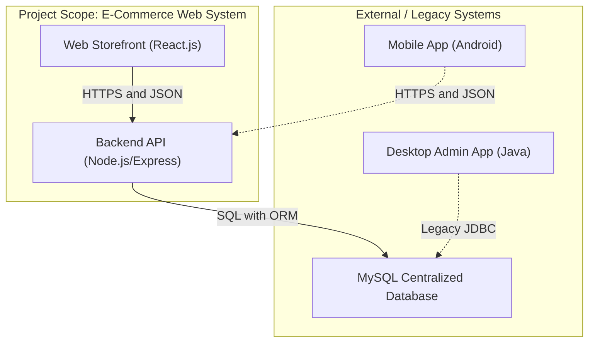

# LPA eComms - Software Architecture Document (Web Implementation)

## 1. System Architecture

### Architectural Pattern: Headless E-Commerce (Decoupled)
The project utilizes a **Headless Architecture**, separating the frontend presentation layer from the backend business logic. This allows the E-Commerce Web Application to be agile and modern while sharing a centralized database with the legacy Desktop system.

* **Scope:** This specific project implements the **Web Storefront** and **Backend API**.
* **External Context:** The system is designed to coexist with a Java Desktop Application (Admin) and Android Application (Mobile) as defined in the broader business requirements[cite: 41, 245].

### Architecture Diagram

