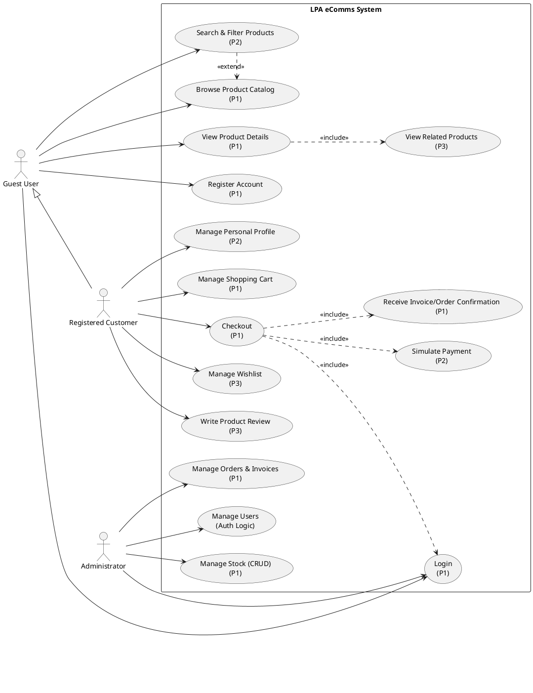

# LPA eComms - Use Case Diagram (Web Implementation)

## Explanation of the Diagram

* **Actors:** 
  * **Guest User:** Represents an unauthenticated visitor. They can only browse, search, and initiate registration/login.
  * **Registered Customer:** Inherits from Guest (denoted by the white arrow). They gain access to the transactional features (Cart, Checkout, Profile)..
  * **Administrator:** Represents the internal staff (likely using the Desktop interface, but interacting with the same backend logic) who manages the inventory and user base.

* **Key Relationships:**
  * **<<'include'>>:** Used in the "Checkout" flow to show that completing a checkout mandatory requires "Login" (authentication), "Simulating Payment" (transaction), and "Receiving Invoice" (system output).
  * **<<'extend'>>:** Used between "Search" and "Browse" to indicate that searching is an optional helper functionality while browsing the catalog.

### Use Case Diagram

# LPA eComms - Use Case Specifications

## 1. Functional Priority Ranking

This table ranks the 12 system functionalities by their implementation priority and strategic importance to the "LPA eComms" project.

| Rank | Functionality / Use Case | Priority | Importance | Rationale |
| :--- | :--- | :--- | :--- | :--- |
| **1** | **Authentication (Login/Register)** | **High (P1)** | **Critical** | Prerequisite for identifying users and securing the checkout process. |
| **2** | **Product Catalog (Browse/View)** | **High (P1)** | **Critical** | The core purpose of the site; users must be able to see what is for sale. |
| **3** | **Shopping Cart Management** | **High (P1)** | **Critical** | Essential for holding items before purchase; persistence is key. |
| **4** | **Checkout & Invoicing** | **High (P1)** | **Critical** | The revenue generation step; creates the legal financial record (Invoice). |
| **5** | **Stock Management (CRUD)** | **High (P1)** | **Critical** | Admins must be able to add inventory, otherwise, the catalog is empty. |
| **6** | **Order Management** | **High (P1)** | **Critical** | Fulfillment; Admins need to see what has been sold to ship it. |
| **7** | **Search & Filtering** | **Medium (P2)** | **Essential** | Critical for UX when the catalog grows; specific to electronics specs. |
| **8** | **Payment Simulation** | **Medium (P2)** | **Essential** | Validates the checkout flow without processing real money (Stripe Sandbox). |
| **9** | **Customer Profile** | **Medium (P2)** | **Essential** | Allows self-service address updates, reducing admin support load. |
| **10** | **Wishlist** | **Low (P3)** | **Value Add** | Increases retention by allowing users to save items for later. |
| **11** | **Product Reviews** | **Low (P3)** | **Value Add** | Social proof; helps other users make decisions but not vital for launch. |
| **12** | **Related Products** | **Low (P3)** | **Value Add** | Recommendation engine to increase Average Order Value (AOV). |

---

## 2. Detailed Use Case Specifications

The following table details the flow and constraints for each prioritized use case.

| Use Case | Goal | Actors | Pre-conditions | Main Flow | Post-conditions |
| :--- | :--- | :--- | :--- | :--- | :--- |
| **1. Authentication** | To securely identify the user and grant access to protected features. | Guest, Customer, Admin | User is not currently logged in. | 1. Actor clicks "Login". 2. Actor enters Email/Password. 3. System hashes password and compares with DB. 4. System issues JWT Token. | User is authenticated; Session token is active. |
| **2. Product Catalog** | To display available products with details (Price, Specs, Stock). | Guest, Customer | None. | 1. User navigates to Shop page. 2. System fetches list from `lpa_stock`. 3. User clicks a product. 4. System displays Product Detail View. | User views accurate product data. |
| **3. Shopping Cart** | To temporarily store items intended for purchase. | Guest, Customer | Product has valid stock (>0). | 1. User clicks "Add to Cart" on a product. 2. System validates stock availability. 3. System updates Cart State (Local/Session). 4. User views Cart to edit Qty/Remove items. | Item is added to session cart; Stock is **not** reserved yet. |
| **4. Checkout & Invoice** | To finalize the purchase and generate a sales record. | Customer | Cart is not empty; User is logged in. | 1. User initiates Checkout. 2. System retrieves saved Shipping Address. 3. User confirms Order Summary. 4. System creates `lpa_invoice` record. 5. System deducts `lpa_stock` count. | Invoice created in DB; Inventory decreased; Cart cleared. |
| **5. Stock Management** | To Create, Read, Update, or Delete inventory items. | Admin | Admin is logged in via Desktop App. | 1. Admin selects "Stock Management". 2. Admin enters Item Details (Name, Price). 3. Admin clicks "Save". 4. System commits to `lpa_stock`. | New product is visible in the Web Catalog immediately. |
| **6. Order Management** | To view and process customer orders. | Admin | Admin is logged in via Desktop App. | 1. Admin selects "Invoices". 2. System displays list of `lpa_invoices`. 3. Admin filters by Status (e.g., "Paid"). 4. Admin views specific Invoice details. | Admin is informed of shipping requirements. |
| **7. Search & Filtering** | To quickly locate specific products by attributes. | Guest, Customer | Product Catalog is populated. | 1. User types query (e.g., "Sony"). 2. User selects filter (e.g., "Price < $500"). 3. System queries DB with `LIKE` or `WHERE` clauses. 4. System updates Product List. | User sees a refined list of relevant products. |
| **8. Payment Simulation** | To validate payment details without real charges. | Customer | User is in Checkout flow (Step 3). | 1. User selects "Credit Card". 2. User enters Mock Data (e.g., `4242...`). 3. System "pings" Stripe Sandbox. 4. Service returns "Success" token. | Payment status recorded as 'Paid' (P) locally. |
| **9. Customer Profile** | To allow users to update their personal information. | Customer | User is logged in. | 1. User goes to "My Profile". 2. User updates "Shipping Address". 3. User clicks "Save". 4. System updates `lpa_clients` table. | Next Checkout will auto-fill the new address. |
| **10. Wishlist** | To save items for future consideration. | Customer | User is logged in. | 1. User clicks "Heart" icon on product. 2. System adds Item ID to User's Wishlist collection. 3. User can view Wishlist later. | Item is saved to profile; No stock is reserved. |
| **11. Product Reviews** | To leave feedback on purchased items. | Customer | User has purchased the item (Verified). | 1. User views Order History. 2. User clicks "Write Review". 3. User sets Star Rating & Comment. 4. System saves review linked to Product. | Review is visible to other customers on Product Page. |
| **12. Related Products** | To suggest items based on current context. | Guest, Customer | User is viewing a Product Detail page. | 1. User views "Laptop". 2. System queries DB for same Category (e.g., "Accessories"). 3. System displays "Mouse" and "Case". | Suggestions appear at bottom of page (Cross-sell). |

